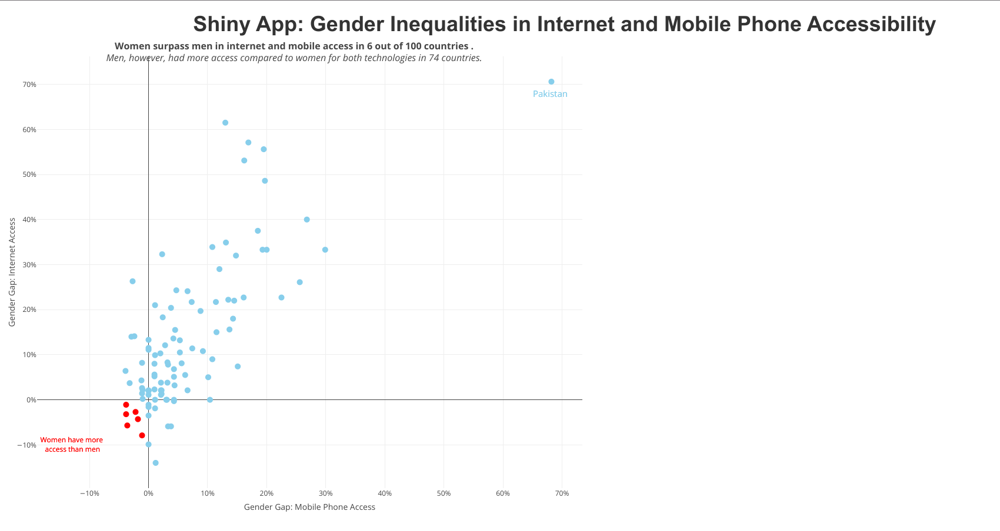

# Shiny App: Gender Inequalities in Internet and Mobile Phone Accessibility

This Shiny app delves into gender imbalances in internet and mobile access worldwide, presenting a visual representation of gender gaps in both mobile phone and internet accessibility for different countries.
This Shiny app, powered by the Rhino framework, focuses on visualizing data through an interactive scatter plot.

Feel free to reach out, contribute, or explore the code to better understand the app's functionality. Happy exploring! 🚀

## App Preview

Check out the app live [here](https://jehangeer.shinyapps.io/Gender_Inequalities_in_Internet_and_Mobile_Phone_Accessibility/).

## Data Source:

[2020/W44: #Viz5 - The digital gender gap](https://data.world/makeovermonday/2020w44)
